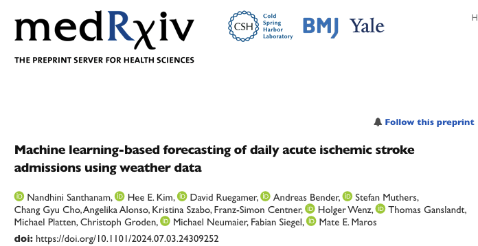

# Machine-learning-based-forecasting-of-acute-ischemic-stroke-admissions-using-weather-data

The project is now available as preprint on medRxiv:

## Machine learning-based forecasting of daily acute ischemic stroke admissions using weather data 

https://www.medrxiv.org/content/10.1101/2024.07.03.24309252v1

    
    

